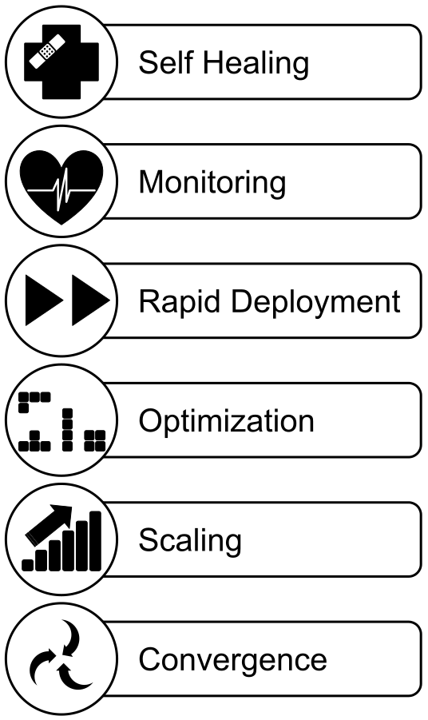

# Self-Driving Infrastructure using Kubernetes on AWS with EKS

This workshop will provide hands on experience on setting up and running an AWS Kubernetes cluster using EKS. We will use gitops, and explore kubernetes tools to make the cluster self-driving, with automated management and remedy of common cluster level problems. To achieve this, we will use eksctl, cluster-autoscaler, kube-prometheus (prometheus operator), node-problem-detector, and draino. For further exploration, please check out the [AWS EKS Workshop](https://eksworkshop.com).

- [Excerise 1: Enrich Your Microservice](#your-microservice)
- [Kubernetes on AWS](#kubernetes-on-aws)
- [Intended Audience](#intended-audience)
- [Prerequisites](#prerequisities)
  - [Create AWS Account](#create-aws-account)
  - [Install AWS CLI](#install-aws-cli)
  - [Install kubectl](#install-kubectl)
  - [Install AWS IAM Authenticator](#install-aws-iam-authenticator)
  - [Install eksctl](#install-eksctl)
  - [Install Docker](#install-docker) (optional)
- [How to make Kubernetes Self-Driving](#self-driving-kubernetes)
  - [Using eksctl](#eksctl)
  - [What is an Operator?](#what-is-an-operator)
  - [Horizontal Pod Autoscaling with kube-prometheus (prometheus operator)](#hpa)
    - [Access the dashboards](#access-dashboards)
  - [node-problem-detector and draino with the cluster autoscaler](#draino)
- [Let It Happen, Cap'n!](#let-it-happen-capn)
- [Clean Up](#cleanup)
- [Kubernetes Concepts Reference](#kubernetes-concepts)

## <a name="your-microservice">Exercise 1: Write your own microservice in one line that provides</a>:
- [ ] High Availability with Health Checks and Automated Recovery
- [ ] Scalability: Automatic horizontal and vertical scaling
- [ ] Security + Policy
- [ ] Service discovery
- [ ] Observabilitiy: Metrics, Tracing, Logs, Alerts
- [ ] Traffic Management
- [ ] Retries
- [ ] Timeouts
- [ ] Load balancing
- [ ] Rate limiting
- [ ] Bulkheading
- [ ] Circuit breaking
- [ ] Actually useful business purpose :point_up_2: those things were for!

<table><tr><td>:bulb: <b>Hint:</b> Kubernetes and a Service Mesh (Istio or Linkerd2) Service Mesh together provide all but the very last one.</td></tr></table>

You either need a rich execution environment allow your microservice to laser focus on business value like [webserver in a single line of code](https://gist.github.com/willurd/5720255), or you need to add so much overhead to your microservice that it winds up not very micro.  

If you can build a straightforward monolithic app and never think about all this asynchronous stuff, go for it! If your system is big enough that you need to refactor into microservices for sanity’s sake, or you need to scale components independently to manage load, or you need to make temporary outages survivable, then microservices with a rich execution environment are a great way to go.

## <a name="kubernetes-on-aws">Ok, Fine. Microservices. But Kubernetes on AWS?</a>

Many of the most powerful architectures involve combining diverse workloads like a stateless web application with a persistent, stateful database, along with periodically running to completion a finite task. Even if these pieces are packed in containers, they still need to be coordinated. We need to deploy, manage, and scale the disparate pieces in different ways.  We also wish to span some pieces over many servers while looking like one single unit to other pieces. On top of this, managing persistent storage is a distinct problem from managing other computational resources.

There are many disparate technical solutions for managing each of the concerns of applications, computational resources, and storage resources. Kubernetes provides a single, common solution to these common problems.

As Paul Ingles said, one of Kubernetes’ greatest strengths is providing a ubiquitous language that connects applications teams and infrastructure teams. And, because it’s extensible, this can grow beyond the core concepts to more domain and business specific concepts.

We also found Kubernetes attractive because it allowed us to iterate quickly for a proof of concept, while giving us built-in resilience and an easy path to scale it in production.

Kubernetes extensible nature, first class support for healthchecks, detailed metrics, and automated recovery for applications make it very simple to automate maintenance and recovery of the Kubernetes platform and it's components.

This workshop will provide hands on experience on running an AWS Kubernetes cluster using EKS. We will use gitops, and explore kubernetes tools to make the cluster self-driving, with automated management and remedy of cluster level problems. To achieve this, we will use eksctl, cluster-autoscaler, external-dns, kube-prometheus (prometheus operator), node-problem-detector, draino, node-local-dns-cache, and dashboard.

Also [Why do I need kubernetes and what can it do](https://kubernetes.io/docs/concepts/overview/what-is-kubernetes/#why-do-i-need-kubernetes-and-what-can-it-do) and ([see why containers](https://kubernetes.io/docs/concepts/overview/what-is-kubernetes/#why-containers))

## <a name="intended-audience">Intended audience</a>
This workshop is intended to appeal primarily to four types of people:

1. Application developers looking to get an AWS Kubernetes cluster to experiment without a lot of infrastructure knowledge
2. AWS DevOps people without a lot of Kubernetes experience
3. Kubernetes DevOps people without a lot of AWS experience
4. Full-stack, [Full-cycle](https://medium.com/netflix-techblog/full-cycle-developers-at-netflix-a08c31f83249) developers in small or large teams.

## <a name="prerequisities">Prerequisites</a>
1. [An AWS Account ($25 credit code will be given on day of the workshop)](#create-aws-account)
2. [aws cli installed and configured to access account](#install-aws-cli)
3. [kubectl installed](#install-kubectl)
4. [aws-iam-authenticator installed](#install-aws-iam-authenticator)
5. [eksctl installed](#install-eksctl)
6. [docker installed](#install-docker)

### <a name="create-aws-account">Create AWS Account</a>
This workshop expects you to [create your own AWS account](https://aws.amazon.com/premiumsupport/knowledge-center/create-and-activate-aws-account/), but participants will be given a $25 cost code to cover any costs incurred during the workshop. A pre-existing VPC is not required. Participants should create their accounts ASAP.  A small percentage of account may be pulled into a manual verification workflow.  Also if any users have accounts that have been deactivated for non-payment it will take some time for them to reactive once a credit card is added.

<table><tr><td>:bulb: <b>Tip:</b> Your account must have the ability to create new IAM roles and scope other IAM permissions.</td></tr></table>

1. If you don't already have an AWS account with Administrator access: [create
one now by clicking here](https://portal.aws.amazon.com/billing/signup#/start)

2. [Create a billing alarm](https://docs.aws.amazon.com/AmazonCloudWatch/latest/monitoring/monitor_estimated_charges_with_cloudwatch.html) - Super important!

### <a name="install-aws-cli">Install the AWS CLI</a>
<table><tr><td>:bulb: <b>Tip:</b> After you have the AWS CLI installed (as below), You will need to have AWS API credentials configured. You can use <a href="https://docs.aws.amazon.com/cli/latest/userguide/cli-configure-files.html"><code>~/.aws/credentials</code> file</a>
or <a href="https://docs.aws.amazon.com/cli/latest/userguide/cli-environment.html">environment variables</a>. For more information read <a href="https://docs.aws.amazon.com/cli/latest/userguide/cli-environment.html">AWS documentation</a>. </td></tr></table>

MacOS users can use [Homebrew](https://brew.sh):
```
brew install awscli
```

and Windows users can use [chocolatey](https://chocolatey.org):
```
chocolatey install awscli
```

If you already have pip and a supported version of Python, and [ideally you know how to set up a virtual environment](https://docs.aws.amazon.com/cli/latest/userguide/install-virtualenv.html). You can install the AWS CLI by using the following command. If you have Python version 3+ installed, we recommend that you use the pip3 command.
```
pip3 install awscli --upgrade --user
```

Although it might provide an outdated version, Linux users can also use the default package managers for installing AWS CLI, e.g.:
```
$ sudo apt-get update awscli                       
$ sudo yum install awscli
```

### <a name="install-kubectl">Install kubectl</a>
Linux or Mac:
```
sudo curl --silent --location -o /usr/local/bin/kubectl curl -LO https://storage.googleapis.com/kubernetes-release/release/$(curl -s https://storage.googleapis.com/kubernetes-release/release/stable.txt)/bin/linux/amd64/kubectl

sudo chmod +x /usr/local/bin/kubectl
```
Or Download the [Windows executable](https://storage.googleapis.com/kubernetes-release/release/v1.14.0/bin/windows/amd64/kubectl.exe)

### <a name="install-aws-iam-authenticator">Install AWS IAM Authenticator</a>
If you have golang installed and your `$PATH` includes `$GOPATH/bin`:
```
go get -u -v github.com/kubernetes-sigs/aws-iam-authenticator/cmd/aws-iam-authenticator
```
Otherwise, download the Amazon EKS-vended aws-iam-authenticator binary from Github Releases:
+ [Linux](https://github.com/kubernetes-sigs/aws-iam-authenticator/releases/download/v0.4.0/aws-iam-authenticator_0.4.0_linux_amd64)

+ [MacOS](https://github.com/kubernetes-sigs/aws-iam-authenticator/releases/download/v0.4.0/aws-iam-authenticator_0.4.0_darwin_amd64)

+ [Windows](https://github.com/kubernetes-sigs/aws-iam-authenticator/releases/download/v0.4.0/aws-iam-authenticator_0.4.0_windows_amd64.exe)

### <a name="install-eksctl">Install eksctl</a>
To download the latest release, run:

```
curl --silent --location "https://github.com/weaveworks/eksctl/releases/download/latest_release/eksctl_$(uname -s)_amd64.tar.gz" | tar xz -C /tmp
sudo mv /tmp/eksctl /usr/local/bin
```

Alternatively, macOS users can use [Homebrew](https://brew.sh):

```
brew tap weaveworks/tap
brew install weaveworks/tap/eksctl
```

and Windows users can use [chocolatey](https://chocolatey.org):

```
chocolatey install eksctl
```

### <a name="install-docker">Install Docker</a>
#### MacOS:
<table><tr><td> :bulb: <b>Tip:</b> Avoid <i>Docker Toolbox</i> and <i>boot2docker</i>. These are older packages that have been ceded by <i>Docker for Mac</i>.</td></tr></table>

```
brew cask install docker       # Install Docker
open /Applications/Docker.app  # Start Docker
```

#### Ubuntu

`docker.io` is available from the Ubuntu repositories (as of Xenial).

```bash
# Install Docker
sudo apt install docker.io
sudo apt install docker-compose

# Start it
sudo systemctl start docker
```

<table><tr><td> :bulb: <b>Tip:</b> If the `docker.io` package isn't available for you, see <a href="https://docs.docker.com/install/linux/docker-ce/ubuntu/">Get Docker CE for Ubuntu</a> for an alternative.</td></tr></table>

#### Windows

Install [Windows Subsystem for Linux][wsl] and choose _Ubuntu_ as your guest OS. Install Docker as you normally would on Ubuntu (see above). After that, [see these instructions](https://github.com/Microsoft/WSL/issues/2291#issuecomment-383698720) for info on how to get it running.

<table><tr><td> :bulb: <b>Tip:</b> Avoid _Docker for Windows_. While it works in most cases, you'll still face NTFS limitations without WSL (eg, lack of symlinks, which is needed for Yarn/npm to work). </td></tr></table>

[wsl]: https://docs.microsoft.com/en-us/windows/wsl/install-win10

#### Other OS's

For other operating systems, see: <https://www.docker.com/community-edition#download>


### Verify the binaries are in the path and executable
```
for command in docker kubectl aws-iam-authenticator eksctl
  do
    which $command &>/dev/null && echo "$command in path" || echo "$command NOT FOUND"
  done
```

## <a name="self-driving-kubernetes">How to make Kubernetes Self-Driving</a>

Amazon EKS works by provisioning (starting) and managing the Kubernetes control plane for you. At a high level, Kubernetes consists of two major components – a cluster of 'worker nodes' that run your containers and the 'control plane' that manages when and where containers are started on your cluster and monitors their status.

Without Amazon EKS, you have to run both the Kubernetes control plane and the cluster of worker nodes yourself. With Amazon EKS, you provision your cluster of worker nodes and AWS handles provisioning, scaling, and managing the Kubernetes control plane in a highly available and secure configuration. This removes a significant operational burden for running Kubernetes and allows you to focus on building your application instead of managing AWS infrastructure.



At present the experience of creating a VPC, EKS cluster, and worker nodes using the web console or using the provided Amazon Machine Image (AMI) and AWS CloudFormation scripts leaves you with something that can be difficult to see how to operationalize or provides a frictionless developer experience.

Fortunately, both the Kubernetes Ecosystem and that of AWS are vast and dynamic, and tools have filled this gap.

### <a name="eksctl">`eksctl` - a CLI for Amazon EKS</a>

While [eksctl](https://github.com/weaveworks/eksctl) started as a simple CLI for EKS, it's clear ambition is to serve both developer use-cases and operational best practices like GitOps. At present, it already does a pretty good job of both.

GitOps takes full advantage of the move towards immutable infrastructure and declarative container orchestration. In order to minimize the risk of change after a deployment, whether intended or by accident via "configuration drift" it is essential that we maintain a reproducible and reliable deployment process.   

Our whole system’s desired state (aka "the source of truth") is described in Git. We use containers for immutability as well as different cloud native tools like Cloudformation to automate and manage our configuration. These tools together with containers and declarative nature of Kubernetes provide what we need for a complete recovery in the case of an entire meltdown.

Meanwhile, Developers want a quick and easy way to spin up a flexible, friendly, and frictionless continuous delivery pipeline so they can focus on delivering business value (or just doing cool stuff) without getting bogged down in yak-shaving (i.e. details, details).

The `eksctl` tool lets us spin up and manage a fully operational cluster with sensible defaults and a broad array of addons and configuration settings. You can choose to pass it flags on the cli (dev mode), or specify detailed configuration via yaml, and checked into git (ops mode). As it improves, it continues to better meet the use cases of both audiences.

### <a name="what-is-an-operator">What is an operator?</a>

From the [operator documentation](https://coreos.com/operators/):
> An Operator is an application-specific controller that extends the Kubernetes API to create, configure and manage instances of complex stateful applications on behalf of a Kubernetes user. It builds upon the basic Kubernetes resource and controller concepts, but also includes domain or application-specific knowledge to automate common tasks better managed by computers.

From Kubernetes official documentation, [Kube-controller-manager](https://kubernetes.io/docs/admin/kube-controller-manager/)
> In applications of robotics and automation, a control loop is a non-terminating loop that regulates the state of the system. In Kubernetes, a controller is a control loop that watches the shared state of the cluster through the API server and makes changes attempting to move the current state towards the desired state. Examples of controllers that ship with Kubernetes today are the replication controller, endpoints controller, namespace controller, and serviceaccounts controller.

An operator is a combination of custom resource types and the controllers that take care of the reconciliation process.

This extensible pattern allows us to collaborate on fully automating all the operation and system administration of even very complex systems. For a list of open source operators and an evaluation of how production ready they are see [Kubernetes Operators](https://kubedex.com/operators/) and the [awesome operators](https://github.com/operator-framework/awesome-operators).

All Operators use the controller pattern, but not all controllers are Operators. It's only an Operator if it's got: controller pattern + API extension + single-app focus.

### <a name="hpa">horizontal pod autoscaling with kube-prometheus (prometheus operator)</a>

The [Prometheus Operator](https://github.com/coreos/prometheus-operator) makes the Prometheus configuration Kubernetes native and manages and operates Prometheus and Alertmanager clusters. It is a piece of the puzzle regarding full end-to-end monitoring.

[kube-prometheus](https://github.com/coreos/kube-prometheus) combines the Prometheus Operator with a collection of manifests to help getting started with monitoring Kubernetes itself and applications running on top of it.

The [kube-prometheus](https://github.com/coreos/kube-prometheus) stack is meant for cluster monitoring, so it is pre-configured to collect metrics from all Kubernetes components. The kube-prometheus stack includes a resource metrics API server for horizontal pod autoscaling, like the metrics-server does. In addition to that it delivers a default set of dashboards and alerting rules.

It provides Kubernetes manifests, Grafana dashboards, and Prometheus rules combined with documentation and scripts to provide easy to operate end-to-end Kubernetes cluster monitoring with Prometheus using the Prometheus Operator.

It includes:

* The [Prometheus Operator](https://github.com/coreos/prometheus-operator)
* Highly available [Prometheus](https://prometheus.io/)
* Highly available [Alertmanager](https://github.com/prometheus/alertmanager)
* [Prometheus node-exporter](https://github.com/prometheus/node_exporter)
* [Prometheus Adapter for Kubernetes Metrics APIs](https://github.com/DirectXMan12/k8s-prometheus-adapter)
* [kube-state-metrics](https://github.com/kubernetes/kube-state-metrics)
* [Grafana](https://grafana.com/)


##### <a name="access-dashboards">Access the dashboards</a>

Prometheus, Grafana, and Alertmanager dashboards can be accessed quickly using `kubectl port-forward` after running the quickstart via the commands below. Kubernetes 1.10 or later is required.

> Note: There are instructions on how to route to these pods behind an ingress controller in the [Exposing Prometheus/Alermanager/Grafana via Ingress](#exposing-prometheusalermanagergrafana-via-ingress) section.

Prometheus

```shell
$ kubectl --namespace monitoring port-forward svc/prometheus-k8s 9090
```

Then access via [http://localhost:9090](http://localhost:9090)

Grafana

```shell
$ kubectl --namespace monitoring port-forward svc/grafana 3000
```

Then access via [http://localhost:3000](http://localhost:3000) and use the default grafana user:password of `admin:admin`.

Alert Manager

```shell
$ kubectl --namespace monitoring port-forward svc/alertmanager-main 9093
```

Then access via [http://localhost:9093](http://localhost:9093)


### <a name="draino">node-problem-detector and draino with the cluster autoscaler</a>

[Cluster Autoscaler](https://github.com/kubernetes/autoscaler/tree/master/cluster-autoscaler/) is a standalone program that adjusts the size of a Kubernetes cluster to meet the current needs.

A node is a worker machine in Kubernetes. There are tons of node problems could possibly affect the pods running on the
node such as:
* Infrastructure daemon issues: ntp service down;
* Hardware issues: Bad cpu, memory or disk, ntp service down;
* Kernel issues: Kernel deadlock, corrupted file system;
* Container runtime issues: Unresponsive runtime daemon;

If problems are invisible to the upstream layers in cluster management
stack, Kubernetes will continue scheduling pods to the bad nodes. The daemonset **[Node Problem Detector](https://github.com/kubernetes/node-problem-detector)**
collects node problems from various daemons and make them visible to the upstream
layers. It is running as a Kubernetes Addon enabled by default in GCE clusters, but we need to manually install it in EKS.

[Draino](https://github.com/planetlabs/draino/) is intended for use alongside the Kubernetes [Node Problem Detector](https://github.com/kubernetes/node-problem-detector) and [Cluster Autoscaler](https://github.com/kubernetes/autoscaler/tree/master/cluster-autoscaler/). The Node Problem Detector can set a node condition when it detects something wrong with a node - for instance by watching node logs or running a script. The Cluster Autoscaler can be configured to delete nodes that are underutilized. Adding Draino to the mix enables auto-remediation:

+ The Node Problem Detector detects a permanent node problem and sets the corresponding node condition.
+ Draino notices the node condition. It immediately cordons the node to prevent new pods being scheduled there, and schedules a drain of the node.
+ Once the node has been drained the Cluster Autoscaler will consider it underutilized. It will be eligible for scale down (i.e. termination) by the Autoscaler after a configurable period of time.

Recently, Draino acquired the ability to support all node condition values and status durations for conditions. This allows us to specify `Ready=Unknown,10m` so that nodes that have lost contact with the control plane for prolonged periods can be assumed to have met unrecoverable conditions. Caution should be exercised when deciding how sensitive to make this reaction.

## <a name="let-it-happen-capn">Let it Happen, Cap'n!</a>
In this repository, there is a script `make-eks.sh` that should set up a functional AWS cluster.

<table><tr><td>:bulb: <b>NOTE:</b> In us-east-1 you are likely to get <code>UnsupportedAvailabilityZoneException</code>. If you do, copy the suggested zones and pass <code>--zones</code> flag, e.g. <code>eksctl create cluster --region=us-east-1 --zones=us-east-1a,us-east-1b,us-east-1d</code>. This may occur in other regions, but less likely. You shouldn't need to use <code>--zone</code> flag otherwise.</td></tr></table>

After that is done, you can run the `init-cluster.sh` script to set up kube-prometheus, draino and all the other stuff mentioned mentioned above.

## <a name="cleanup">Cleanup and Notes</a>

Make sure to list any clusters you made `eksctl get cluster --region=us-east-1` and to delete them: `eksctl delete cluster --region=us-east-1 --name=${CLUSTER_NAME}`. Then go in to your AWS console and ensure that there's no lingering stacks in CloudFormation, and NAT gateways.

You can also run `cleanup.sh` to do this for you.

## <a name="kubernetes-concepts">Kubernetes Concepts</a>

Under the hood, Kubernetes uses iptables, DNS, and linux kernel namespaces and cgroups (docker containers) to orchestrate containers distributed across one or more physical host machines.

#### Pods

Kubernetes organizes discrete groups of containers into __Pods__. For instance, each BlazeGraph container also needs a sidecar container to run the updater, and another sidecar container to run the wdqs-proxy. These are organized into a single Pod.

#### Replica Set
A __Replica Set__ specifies a Pod template, and manages how many pod copies there should be. If we want to scale up to five instances of BlazeGraph, or if one Pod crashed and needed to be replaced, the Replica Set would manage this.

#### Deployment
A __Deployment__ is an object which can own ReplicaSets and update them and their Pods via declarative, server-side rolling updates.

#### StatefulSet
Like a Deployment, a __StatefulSet__ manages Pods that are based on an identical container spec. Unlike a Deployment, a StatefulSet maintains a sticky identity for each of their Pods. These pods are created from the same spec, but are not interchangeable: each has a persistent identifier that it maintains across any rescheduling.

#### Service
A Kubernetes __Service__ is an abstraction which defines a logical set of Pods and a policy by which to access them - sometimes called a micro-service. The set of Pods targeted by a Service is (usually) determined by a Label Selector.

#### Ingress
__Ingress__ manages external access to the services in a cluster, typically HTTP.

#### Volume
A __Volume__ is just a directory, possibly with some data in it, which is accessible to the Containers in a Pod. It can be shared among multiple containers in the Pod. A volume lives as long as the Pod does, even if a container in the pod restarts.

#### PersistentVolume
A __PersistentVolume__ (PV) is a piece of storage in the cluster that has been provisioned by an administrator. It is a resource in the cluster just like a node is a cluster resource. PVs have a lifecycle independent of any individual Pod that uses the PV.

## Recommended Further exploration

For further exploration, please check out the [AWS EKS Workshop](https://eksworkshop.com).

Catalogs of Existing Operators:
- [Kubedex Operators](https://kubedex.com/operators/)
- [OperatorHub](https://operatorhub.io/),
- [Awesome Operators](https://github.com/operator-framework/awesome-operators)

Create your own operator:
- [Go - Operator Framework](https://github.com/operator-framework/operator-sdk)
- [Go - KubeBuilder](https://github.com/kubernetes-sigs/kubebuilder)
- [Python Operator](https://github.com/zalando-incubator/kopf)
- [Shell Operator](https://github.com/flant/shell-operator)
- [JavaScript Operator](https://github.com/dot-i/k8s-operator-node)
- [Comparison of Operator Choices](https://admiralty.io/blog/kubernetes-custom-resource-controller-and-operator-development-tools/)

Kubebuilder and Operator Framework SDK use the same underlying libraries ([controller-runtime](https://github.com/kubernetes-sigs/controller-runtime) & [controller-tools](https://github.com/kubernetes-sigs/controller-tools)), but with slightly different layouts.  They're actually working on unifying the two but the skaffolding layout is still a little different at present.


+ [Understanding Kubernetes Controllers](https://leftasexercise.com/2019/07/08/understanding-kubernetes-controllers-part-i-queues-and-the-core-controller-loop/)

### Funny stuff
Found on imgur (not my work):
[](./images/talk_about_crds.mp4)
